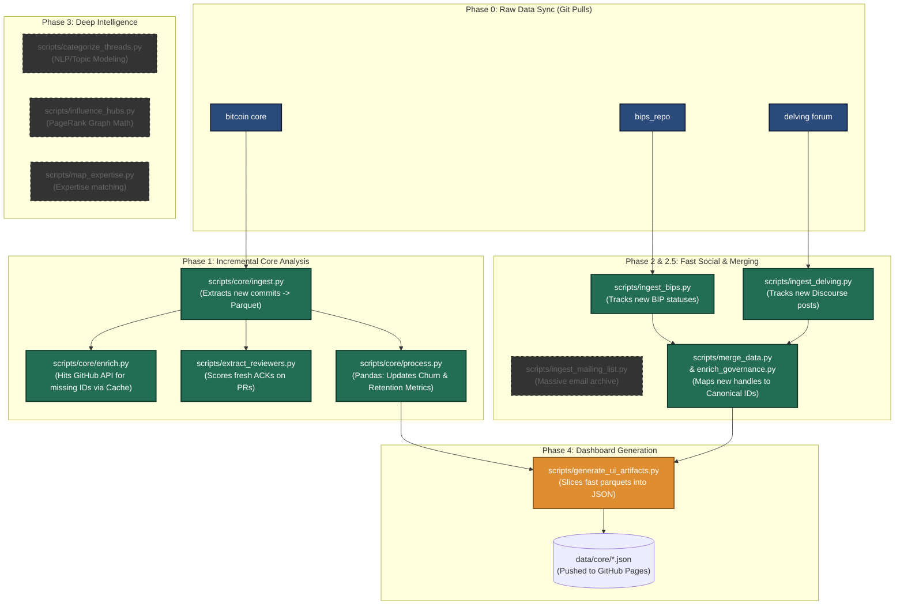
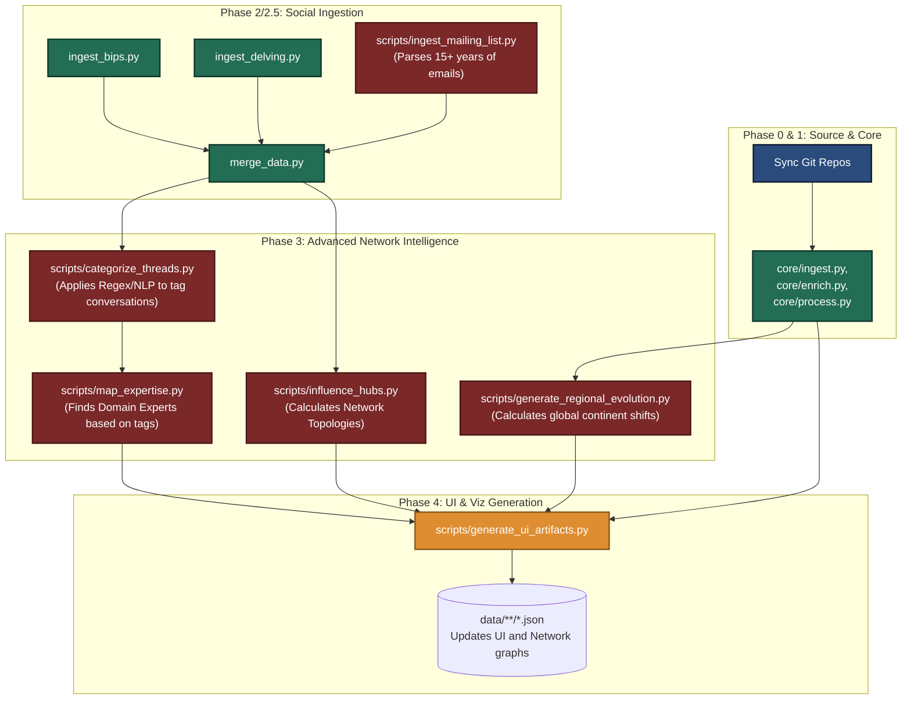

# Pipeline Orchestration Flow

This document provides a visual and diagrammatic breakdown of the difference between the **Daily** (`scripts/rebuild_daily.py`) and **Monthly** (`scripts/rebuild_monthly.py`) pipelines.

## 1. The Daily Pipeline (Incremental & Fast)
The daily pipeline is optimized for speed. It is triggered by GitHub Actions every night. It strictly avoids any natural language processing, graphing algorithms, or parsing of massive historical archives (like the mailing list).

---

## 2. The Monthly Pipeline (Deep Analytics)
The monthly pipeline runs locally on your machine. It executes *everything* the daily pipeline does, plus the computationally expensive "Phase 3" operations. This updates the complex PageRank topologies and NLP classifications.

## Summary of Actionable Differences
* **`rebuild_daily.py`** gets the user their immediate PR, Commit, and new Discussion metrics instantly by skipping `mail`, `nlp`, and `topologies`.
* **`rebuild_monthly.py`** is the master generator that resets the global "Expertise", "Influence Graph", and "NLP Themes".
