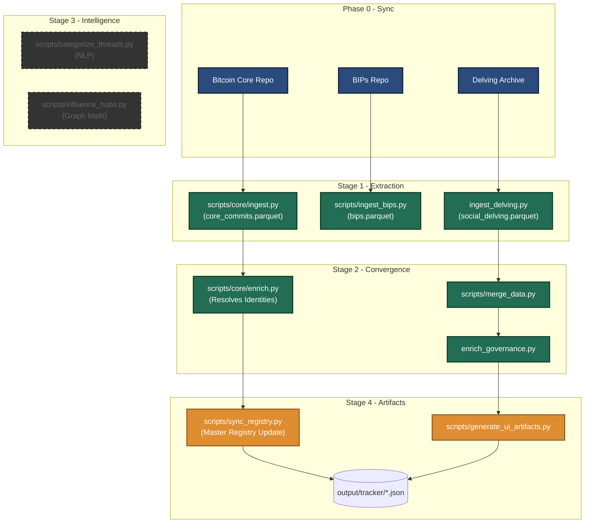
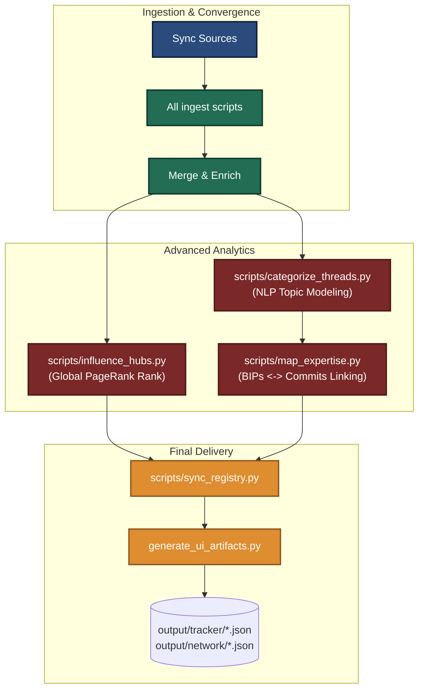

# Pipeline Orchestration Flow

This document details the execution cycles of the Orange Dev Data Engine. The pipeline is split into **Daily** and **Monthly** flows to balance the need for fresh metrics with the high computational cost of NLP and graph theory.

---

## 1. The Daily Pipeline (Incremental & Fast)
The daily pipeline is optimized for speed and is triggered automatically by GitHub Actions. It focuses on repository updates and new contribution tracking while bypassing heavy "thought-space" analytics.

---

## 2. The Monthly Pipeline (Deep Analytics)
The monthly pipeline runs locally on an Anaconda environment. It performs a full refresh of the Bitcoin "Intelligence Graph," including PageRank influence and expertise fingerprinting.

## Critical Orchestration Differences
*   **Daily**: Prioritizes "What happened today?" (Commits, New BIPs, Fresh Discussions).
*   **Monthly**: Prioritizes "How has the community changed?" (Who are the influencers? Who are the new experts? How are themes evolving?).
