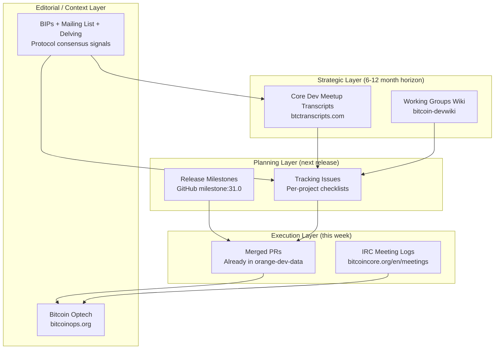

# Bitcoin Core Roadmap — Data Source Analysis

> Based on [@schmidty's Stacker News post](https://stacker.news/items/1275058): *"Where is the public roadmap for Bitcoin Core?"*

## The Core Insight

Schmidty makes a critical distinction: there is **no single authoritative roadmap** for Bitcoin Core because it is a decentralized open-source project. Instead, the roadmap must be **synthesized** from multiple independent signals. This is *exactly* the kind of problem we can solve with data pipelines + LLM summarization.

---

## Data Source Comparison Table

| # | Source | URL / API | What You Get | Data Frequency | Quality | Scrapeability | Roadmap Value |
|---|--------|-----------|-------------|----------------|---------|--------------|---------------|
| 1 | **Working Groups Wiki** | [bitcoin-devwiki/wiki/Working-Groups](https://github.com/bitcoin-core/bitcoin-devwiki/wiki/Working-Groups) | List of active working groups (Erlay, Fuzzing, Kernel, Benchmarking, Silent Payments, Cluster Mempool, Stratum v2, Multiprocess, QML GUI, Net Split), their leads, meeting schedules | Updates ~monthly (wiki edits) | ⭐⭐⭐⭐⭐ **Excellent** — Canonical, curated by devs themselves | Easy — GitHub wiki has git-backed raw content accessible via clone of `bitcoin-core/bitcoin-devwiki.wiki.git` | 🔴 **Critical** — Defines the "themes" of active development |
| 2 | **IRC Meeting Logs** | [bitcoincore.org/en/meetings/](https://bitcoincore.org/en/meetings/) + [gnusha.org IRC logs](https://gnusha.org/bitcoin-core-dev/) | Weekly meeting notes, topic summaries, who proposed what, working group update reports | **Weekly** (every Thursday) | ⭐⭐⭐⭐ **High** — Structured meeting summaries exist; raw IRC logs are noisy but rich | Medium — Static Jekyll site, RSS feed available (`meetingrss.xml`); raw IRC logs on gnusha.org as plain text | 🟠 **High** — Shows what's actively being discussed and prioritized each week |
| 3 | **Tracking Issues** | GitHub API (`github.com/bitcoin/bitcoin/issues/{id}`) | Per-project TODO lists: checklist items, completion %, linked PRs, discussion threads | **Real-time** (updated when PRs merge) | ⭐⭐⭐⭐⭐ **Excellent** — First-party progress tracking by the devs doing the work | Easy — GitHub REST/GraphQL API, already familiar from `orange-dev-data/scripts/01_ingest/core.py` | 🔴 **Critical** — Most granular "roadmap" signal; shows actual progress toward project goals |
| 4 | **Core Dev Meetup Transcripts** | [btctranscripts.com/bitcoin-core-dev-tech/](https://btctranscripts.com/bitcoin-core-dev-tech/) | Full transcripts of in-person developer meetings (topics include kernel, wallet, mempool, mining, P2P, etc.) | **~2x/year** (Feb + Oct historically) | ⭐⭐⭐⭐⭐ **Excellent** — Verbatim transcripts, community-reviewed, highly technical | Medium — The site is Next.js SSR; individual transcript pages have markdown content. The underlying [`bitcointranscripts/bitcointranscripts`](https://github.com/bitcointranscripts/bitcointranscripts) GitHub repo has raw `.md` files | 🔴 **Critical** — The *strategic* layer; reveals what devs plan for the next 6-12 months |
| 5 | **Merged PRs** | GitHub API (`github.com/bitcoin/bitcoin/pulls?q=is:pr+is:merged`) | Every code change that will ship in the next release: title, author, labels, area, files changed, review comments | **Daily** (multiple PRs merge per day) | ⭐⭐⭐⭐⭐ **Excellent** — Ground truth of what's actually shipping | Easy — **Already ingested** by `orange-dev-data/scripts/01_ingest/core.py` | 🟠 **High** — Shows the "what's actually happening" vs. "what's planned" |
| 6 | **Bitcoin Optech Newsletter** | [bitcoinops.org](https://bitcoinops.org/) + [RSS feed](https://bitcoinops.org/feed.xml) | Weekly curated coverage: notable merged code, protocol discussions, vulnerability disclosures, new features explained | **Weekly** (every Wednesday) | ⭐⭐⭐⭐⭐ **Gold Standard** — Professional, accurate, deeply researched by Dave Harding et al. | Easy — Static Jekyll site, RSS/Atom feed, underlying content in [GitHub repo](https://github.com/bitcoinops/bitcoinops.github.io) as markdown | 🔴 **Critical** — Best "editorial layer" to contextualize raw signals. The "Notable code changes" section directly maps PRs to user impact |
| 7 | **Release Milestones** | GitHub API (`github.com/bitcoin/bitcoin/pulls?q=is:pr+milestone:{version}`) | PRs tagged for specific releases (e.g., v30.0, v31.0): what features/fixes are targeted for next release | **Per-release cycle** (~6 months) | ⭐⭐⭐⭐ **High** — Directly curated by maintainers; but not all PRs get tagged | Easy — GitHub API milestone query, can filter by `milestone:31.0` | 🔴 **Critical** — The closest thing to an "official" near-term roadmap |
| 8 | **BIPs + Mailing List + Delving** | `github.com/bitcoin/bips` + `gnusha.org/pi/bitcoindev/` + `delvingbitcoin.org` | Protocol-level proposals (BIPs), social consensus signals (ACK/NACK), deep technical research discussions | Mixed: BIPs ~monthly, Mailing list daily, Delving daily | ⭐⭐⭐⭐ **High** — Canonical but noisy; requires cross-referencing | Medium — **Already architected** in your [BIP Integration KI](file:///Users/saurabhkumar/.gemini/antigravity-ide/knowledge/orange_dev_tracker_bip_integration/artifacts/data_strategy.md): `ingest_bips.py`, `ingest_mailing_list.py`, `ingest_delving.py` | 🟡 **Medium for Core roadmap** — More about *protocol* direction than *software* direction, but crucial for understanding consensus-level changes |

---

## Detailed Source Analysis

### 1. Working Groups Wiki
- **URL**: `https://github.com/bitcoin-core/bitcoin-devwiki/wiki/Working-Groups`
- **Current Groups**: Erlay, Fuzzing, Kernel, Benchmarking, Silent Payments, Cluster Mempool, Stratum v2, Multiprocess, QML GUI, Net Split
- **How to Ingest**: `git clone https://github.com/bitcoin-core/bitcoin-devwiki.wiki.git` → parse markdown files
- **Frequency**: Check weekly for diffs via `git pull`
- **Key Signal**: The *existence* of a working group = active investment of developer time. If a group is disbanded or created, that's a strong roadmap signal.

### 2. IRC Meeting Logs
- **URL**: `https://bitcoincore.org/en/meetings/` (summaries) + `https://gnusha.org/bitcoin-core-dev/` (raw logs)
- **Format**: The bitcoincore.org site is a static Jekyll site with an RSS feed at `/en/meetingrss.xml`
- **Frequency**: Weekly, every Thursday at 19:00 UTC
- **Key Signal**: Working group updates, priority discussions, blockers. The meeting summaries are semi-structured (topics, action items).
- **LLM Opportunity**: Raw IRC logs → LLM → "This week's meeting focused on X, Y, Z. Key decisions: A, B."

### 3. Tracking Issues (GitHub)
- **Known Issues**:
  - Multiprocess: [#28722](https://github.com/bitcoin/bitcoin/issues/28722)
  - Mining interface: [#33777](https://github.com/bitcoin/bitcoin/issues/33777)
  - MuSig2: [#31246](https://github.com/bitcoin/bitcoin/issues/31246)
  - Cluster mempool: [#30289](https://github.com/bitcoin/bitcoin/issues/30289)
  - Erlay: [#30249](https://github.com/bitcoin/bitcoin/issues/30249)
  - Bitcoin Kernel Library: [#27587](https://github.com/bitcoin/bitcoin/issues/27587)
  - SENDTEMPLATE: [#33691](https://github.com/bitcoin/bitcoin/issues/33691)
- **How to Ingest**: GitHub API — fetch issue body (which contains checklist), linked PRs, comments
- **Frequency**: Real-time. Check daily or weekly.
- **Key Signal**: Checkbox completion percentage = "how close is this project to done?"
- **LLM Opportunity**: Parse task list from issue body → compute % complete → track over time

### 4. Core Dev Meetup Transcripts
- **URL**: `https://btctranscripts.com/bitcoin-core-dev-tech/`
- **Recent Meetings**: Oct 2025, Feb 2025 (plus earlier ones)
- **Raw Source**: [bitcointranscripts/bitcointranscripts](https://github.com/bitcointranscripts/bitcointranscripts) GitHub repo
- **Frequency**: ~2 meetings/year
- **Key Signal**: Strategic direction, deep dives into architecture decisions, areas where devs are investing multi-year effort
- **LLM Opportunity**: Feed transcript markdown → "Extract the top 5 projects discussed, estimated timeline, and any blockers mentioned"

### 5. Merged PRs
- **URL**: `https://github.com/bitcoin/bitcoin/pulls?q=is:pr+is:merged`
- **Status**: **Already ingested** by your existing `core.py` pipeline in `orange-dev-data`
- **Frequency**: Daily
- **Key Signal**: Ground truth — what code actually shipped. Cross-reference with tracking issues to compute project progress.

### 6. Bitcoin Optech Newsletter  
- **URL**: `https://bitcoinops.org/`
- **RSS**: `https://bitcoinops.org/feed.xml`
- **Raw Source**: [bitcoinops/bitcoinops.github.io](https://github.com/bitcoinops/bitcoinops.github.io) — newsletters in `_posts/en/newsletters/`
- **Frequency**: Weekly (Wednesday)
- **Key Signal**: Curated "Notable code changes" section is the best human-edited mapping of PRs → impact. Also covers vulnerability disclosures, new softfork proposals, and protocol changes.
- **LLM Opportunity**: Already well-structured markdown. Extract the "Notable code and documentation changes" section → cross-reference with your merged PR data

### 7. Release Milestones
- **URL**: `https://github.com/bitcoin/bitcoin/pulls?q=is:pr+milestone:31.0`
- **How to Ingest**: GitHub API — list PRs with milestone filter
- **Frequency**: Per-release (~every 6 months for major)
- **Key Signal**: What maintainers consider "must-ship" for next release
- **Schmidty's v31 Predictions**: Kernel API, MuSig2 (wallet), Cluster mempool, ASMap, Static builds

### 8. BIPs + Mailing List + Delving Bitcoin
- **Status**: **Architecture already designed** in your [BIP Integration KI](file:///Users/saurabhkumar/.gemini/antigravity-ide/knowledge/orange_dev_tracker_bip_integration/artifacts/data_strategy.md)
- **Key Signal**: Protocol-level direction (consensus changes, new opcodes, softforks)
- **Distinction**: This is about the *Bitcoin protocol* roadmap, not the *Bitcoin Core software* roadmap. But there's significant overlap (e.g., Cluster Mempool is both a software project and affects relay policy).

---

## Synthesis Strategy: Weaving It Together

### The Roadmap Layer Model



### How Each Source Feeds the Roadmap Report

| Roadmap Section | Primary Source(s) | Enrichment Source | LLM Role |
|----------------|-------------------|-------------------|----------|
| **"Active Projects & Status"** | Tracking Issues (#28722, #30289, etc.) | Merged PRs (compute % done by counting merged linked PRs) | Summarize each project's current status in 2-3 sentences |
| **"What's Coming in v31"** | Release Milestones (`milestone:31.0`) | Optech newsletters (context for each feature) | Generate a user-friendly description of each expected feature |
| **"Working Group Activity"** | Working Groups Wiki + IRC Meetings | Merged PRs per area | "This week, the Kernel working group merged X PRs and discussed Y" |
| **"Strategic Direction"** | Core Dev Meetup Transcripts | Delving Bitcoin threads | Extract long-term themes ("The project is investing heavily in modularization and libbitcoinkernel") |
| **"Protocol Evolution"** | BIPs + Mailing List + Delving | Tracking Issues (linking BIPs to implementation PRs) | "BIP-XXX (Status: Draft) has 3 active implementation PRs and significant mailing list debate" |
| **"This Week's Highlights"** | `this-week-in-bitcoin` output | Optech newsletter | Already built! Just embed the weekly report |

### Proposed Data Pipeline

```
1. INGEST (orange-dev-data)
   ├── Existing: core.py (merged PRs, reviews)
   ├── Existing: bips.py, mailing_list.py, delving.py  
   ├── NEW: working_groups.py (clone devwiki, parse wiki pages)
   ├── NEW: tracking_issues.py (fetch known tracking issues, parse checklists)
   ├── NEW: irc_meetings.py (fetch from bitcoincore.org RSS or gnusha.org)
   ├── NEW: optech.py (clone optech repo, parse newsletter markdown)
   └── NEW: milestones.py (fetch milestone-tagged PRs from GitHub API)

2. PROCESS (orange-dev-data)
   ├── Cross-link: tracking issue tasks ↔ merged PRs
   ├── Cross-link: BIPs ↔ tracking issues ↔ mailing list threads
   ├── Compute: project completion % (checked items / total items)
   └── Compute: velocity (PRs merged per project per week)

3. ENRICH (LLM at build-time)
   ├── Summarize each project's status (from tracking issue + merged PRs)
   ├── Summarize meetup transcripts (key themes, timelines, blockers)
   ├── Summarize Optech "Notable code" sections
   └── Generate roadmap narrative ("The project is focusing on X, Y, Z")

4. DELIVER
   ├── roadmap.json → orange-dev-tracker frontend
   ├── Weekly roadmap update → this-week-in-bitcoin newsletter
   └── Static artifacts for GitHub Pages
```

### Priority Order for Implementation

| Priority | Task | Effort | Impact |
|----------|------|--------|--------|
| 🔴 P0 | **Tracking Issues ingestion** — Parse the 7 known tracking issues, extract checklists, compute completion % | Low (GitHub API, already have auth) | Highest — Immediate "project progress" view |
| 🔴 P0 | **Release Milestones** — Fetch PRs tagged `milestone:31.0` | Low (simple API query) | High — "What's in the next release" |
| 🟠 P1 | **Working Groups Wiki** — Clone devwiki, parse wiki markdown | Low | High — Defines the "themes" |
| 🟠 P1 | **Optech Newsletter** — Clone repo, parse notable code sections | Medium (markdown parsing) | High — Best editorial context |
| 🟡 P2 | **IRC Meeting Summaries** — RSS feed or scrape bitcoincore.org | Medium | Medium — Weekly pulse |
| 🟡 P2 | **Core Dev Meetup Transcripts** — Clone bitcointranscripts repo, parse markdown | Medium | High but infrequent (2x/year) |
| 🟢 P3 | **LLM Roadmap Synthesis** — Combine all sources into a narrative roadmap report | Medium-High | Highest — The "wow" deliverable |

---

## Quality & Reliability Assessment

| Source | Accuracy | Completeness | Bias Risk | Staleness Risk |
|--------|----------|-------------|-----------|---------------|
| Working Groups Wiki | Very High | Moderate (may miss informal groups) | Low | Medium (wiki may lag reality) |
| IRC Meetings | High | High (verbatim logs) | Low | Low (weekly) |
| Tracking Issues | Very High | High (devs maintain these) | Low | Low (real-time) |
| Core Dev Transcripts | Very High | High | Low | High (only 2x/year) |
| Merged PRs | **Perfect** (ground truth) | **Complete** | None | None |
| Optech Newsletter | Very High | Curated (intentionally selective) | Low (professional editorial team) | Low (weekly) |
| Release Milestones | High | Moderate (not all PRs are tagged) | Low | Medium (updated as release approaches) |
| BIPs/ML/Delving | High | High | Medium (strong opinions common) | Low (continuous activity) |

---

## Key Observations

> [!IMPORTANT]
> **The best roadmap for a decentralized project is a data-driven synthesis, not a single source.** Schmidty essentially gave us the recipe. Our job is to automate it.

> [!TIP]
> **Your existing infrastructure covers ~40% of this already.** `orange-dev-data` ingests merged PRs, BIPs, mailing list, and Delving. `this-week-in-bitcoin` already does LLM summarization of weekly activity. The new work is: tracking issues, milestones, working groups, Optech, and the synthesis layer.

> [!NOTE]
> **The Optech newsletter is arguably the single most valuable external source.** It's professionally curated, deeply technical, and its "Notable code changes" section is essentially a human-edited roadmap update every week. We should prioritize ingesting it.

